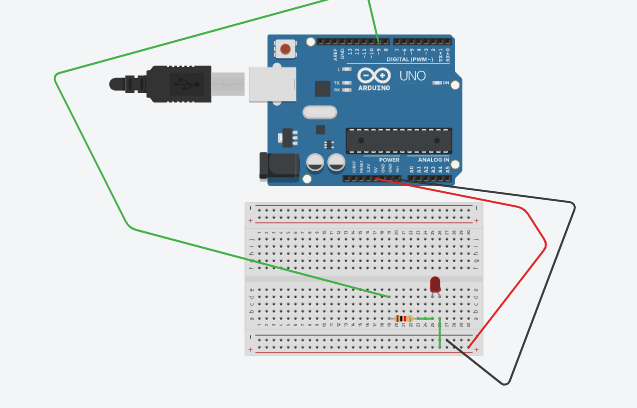

# NotSoBasicArduino
 The following files are my second foray into Arduino
 
 
## Table of Contents
* [Table of Contents](#TableOfContents)
* [LED_Fade](#LED_Fade)
* [Finite Blinker](#Finite_Blinker)
* [Hello_LCD](#Hello_LCD)
* [FillMeInLAter](#FillMeInLAter)
---

## LED_Fade

### Description & Code
Making the arduino fade using analogWrite and variables to change the brightness.

```C++
// set the brightness of pin 9:
  analogWrite(led, brightness);

  // change the brightness for next time through the loop:
  brightness = brightness + fadeAmount;

  // reverse the direction of the fading at the ends of the fade:
  if (brightness <= 0 || brightness >= 255) {
    fadeAmount = -fadeAmount;
  }
```
analogWrite sets the led brightness to the "brightness" variable and then the 
brightness is either increased or decreased by the "fadeAmount" variable.
### Evidence
https://create.arduino.cc/editor/inovotn04/c8784bd7-16b9-4bf7-9797-a1a1dd349e99/preview

### Images

### Reflection
The actual normal part of it went fine, the only trouble I had was before I realized the LED needed to be in a digital pin (one of the pins with the little ~) however making the extra spicy part where you made had the serial monitor print the brightness in a series of lines so it looks similar to like a pulse monitor or something was rather hard, I ended up settling on making a kinda counter variable that increased by one in a while() loop and the loop continued until the variable was equal to the brightness. 
P.S.
if you do my method for the serial monitor, make sure to add a 
```C++
Serial.println(-); 
```
outside of the while() loop so it's not just one continuous line.


## Finite_Blinker

### Description & Code
Using an increasing variable to make an LED light blink 5 times and stop.

Code:

```C++
void loop() {
  if(counter < 5){
  
    digitalWrite(LED, HIGH);   // the blink loop, turning the LED on and off with a second in between
    delay(1000);                       
    digitalWrite(LED, LOW);    
    delay(1000);
    
    counter = counter + 1;     // beautiful variable code
    Serial.println(counter);
}
}
```
The if statement makes it so the the part that makes the LED blink only runs if the "counter" variable is less than 5, every loop the counter variable increases by 1, making it so the loop only runs 5 times, and the LED only blinks 5 times.

### Evidence
https://create.arduino.cc/editor/inovotn04/2bb4b387-59b8-4979-a6ed-fa6a11f9173d/preview

### Images


### Reflection
I went through this without any road bumps really, but make sure if you do this to not do it the day it's due because I have a lot of other homework now and I would've done the extra spicy part with two LED lights but there's an essay due at midnight tonight so I really cannot. Takeway: manage your time better than me.

## Hello_LCD

### Description & Code
Description goes here

Here's how you make code look like code:

```C++
Code goes here
```
Talk about how the code works, here....

### Evidence
link goes here

### Images
draw it yourself, take a picture, make a fritzing, whatever you want to EFFECTIVELY communicate how its put together.

### Reflection

